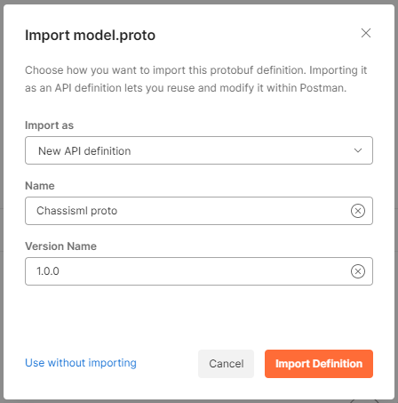

# Interact with Container in Postman

After building a container with Chassisml, there are several ways to interact with it: via [Modzy](https://www.modzy.com/try-free/), [KServe](https://kserve.github.io/website/0.8/), or locally on your machine. This tutorial demonstrates how to make API calls to a container locally using Postman.

!!! note
    You can follow this tutorial if you have not yet built your own container, or alternatively you can replace the sample container with your own.

## Getting started

### Install Required Dependencies

* Install [Docker](https://docs.docker.com/get-docker/)
    * Open a terminal on your machine, and try to run `docker ps`
        * If you get a permissions error, follow instructions [here](https://docs.docker.com/engine/install/linux-postinstall/)
* Install [Postman](https://www.postman.com/downloads/)
* Download [proto file](https://github.com/modzy/chassis/blob/main/service/flavours/mlflow/interfaces/modzy/protos/model2_template/model.proto)

### Download Sample Container

```bash
docker pull <add chassis public image to modzy repo?>
```

## Run Container Locally

Before interacting with the container using Postman, we need to first spin up the container and port forward it to a port we will use in the local URL configuration in Postman.

```bash
docker run -p 45000:5000 -it <container image>
```

In this docker command, we use the following parameters:
* -p: Forwards the port serving the gRPC server inside the container (45000) to a local port (5000)
* -it: Runs container interactively, so you can see the logs from the container as you make API calls to it

To learn more, visit the [Docker run](https://docs.docker.com/engine/reference/run/) reference documentation.

After running the container, you should see this logs message printed to your terminal:

```
<TODO FILL IN>
```

## Send gRPC Requests to Running Container

Once the container is running locally, open the Postman app. On the upper left of the screen, select **New** and open **gRPC Request**.

{ style="border:20px solid white" }

Enter your local server URL into the first box.

{ style="border:20px solid white" }

In the second box, select the **Import protobuf definition from local file** and upload the [proto file](https://github.com/modzy/chassis/blob/main/service/flavours/mlflow/interfaces/modzy/protos/model2_template/model.proto) you downloaded during setup.

{ style="border:20px solid white" }

Give your protobuf a name and version.

{ style="border:20px solid white" }

The three remote procedure calls defined in the protobuf file (to which our Chassisml container adheres to) will appear in the **Select a method** dropdown.

{ style="border:20px solid white" }

We are now ready to invoke requests to 


??? test question box

> :warning


